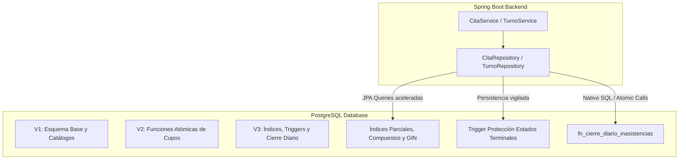

# Documentación Técnica de Base de Datos - Hospital Regional de Occidente (HRO)

**Sistema Hospitalario HRO**  
**Motor:** PostgreSQL 15+ / 16  
**Gestor de Migraciones:** Flyway  
**Capa de Persistencia:** Spring Data JPA + Hibernate  
**Última actualización:** Septiembre 2026  

---

## 1. Resumen de Arquitectura de Datos

La base de datos del HRO está diseñada para soportar operaciones críticas de alta concurrencia, garantizando **cero sobreventa de cupos médicos**, **trazabilidad e inmutabilidad clínica** y **consultas de alto rendimiento** tanto para personal administrativo/médico como para pantallas informativas de sala de espera.

Para evitar que el backend Java centralice toda la carga y mitigar posibles condiciones de carrera (*race conditions*), se delegaron operaciones atómicas, reglas de integridad y procesos por lotes directamente al motor de PostgreSQL mediante **funciones PL/pgSQL, triggers y un esquema exhaustivo de indexación**.



---

## 2. Historial de Migraciones Flyway

Las migraciones residen en `backend/src/main/resources/db/migration/` y se respaldan en `database/migrations/`:

| Versión | Script | Propósito y Alcance |
| :--- | :--- | :--- |
| **V1** | `V1__esquema_inicial.sql` | Esquema base DDL: Especialidades, Clínicas, Médicos, Pacientes, Cupos, Citas, Turnos, Laboratorio y Auditoría General. |
| **V2** | `V2__corregir_funciones_cupos.sql` | Corrección de retorno en `fn_incrementar_cupo` (adaptación a `ROW_COUNT INT`) e implementación de `fn_decrementar_cupo`. |
| **V3** | `V3__optimizaciones_indices_triggers.sql` | **Optimización global:** 7 índices de alto rendimiento, triggers de inmutabilidad clínica, compatibilidad con Hibernate y función atómica de cierre diario. |
| **V4** | `V4__espacios_fisicos_y_asignacion_diaria.sql` | Separa el espacio físico de la subespecialidad e introduce la asignación diaria (`asignacion_diaria_espacio`, `cierre_asignacion_diaria`, `plano_hospital`). |
| **V5** | `V5__claves_primarias_uuid.sql` | Cambia a UUID las claves primarias de las tablas principales (paciente, medico, cupo_diario, orden_laboratorio, etc.) con backfill sin pérdida de datos. |
| **V6** | `V6__seguimiento_expedientes_fisicos.sql` | **Ciclo de vida físico del expediente:** `ubicacion_archivo`, `expediente`, `expediente_ciclo` (un viaje por cita) y `expediente_movimiento` (bitácora de checkpoints). |

### 2.1 Seguimiento de expedientes físicos (V6)

El módulo de Archivo modela el recorrido físico del expediente con el mismo patrón de seguimiento tipo paquete usado en `cita` → `cita_estado_historial`, en tres niveles:

| Tabla | Nivel | PK | Descripción |
| :--- | :--- | :--- | :--- |
| `ubicacion_archivo` | Catálogo | `BIGINT` | Ubicaciones físicas normalizadas (pasillo/estante/balda). |
| `expediente` | Objeto físico | `UUID` | El expediente en sí; uno por paciente. PK escaneable como código de barras/QR. |
| `expediente_ciclo` | Viaje | `UUID` | Un ciclo por cita (`cita_id UNIQUE`); guarda el `estado_actual` del recorrido. |
| `expediente_movimiento` | Bitácora | `BIGINT` | Cada checkpoint del ciclo (append-only), con usuario, ubicaciones y fecha. |

Estados válidos de `expediente_ciclo.estado_actual`:
`pendiente_localizar`, `en_busqueda`, `localizado`, `en_transito_entrega`, `entregado`, `en_transito_retorno`, `archivado`, `no_localizado`.

Notas de diseño:
- `expediente.numero_expediente` está **desnormalizado** desde `paciente.numero_expediente` (dato prácticamente inmutable) para búsquedas rápidas y para que el código de barras impreso no dependa de un JOIN.
- `expediente_ciclo.version` implementa bloqueo optimista; el trigger `trg_expediente_ciclo_actualizar_marca_tiempo` usa la función dedicada `fn_expediente_ciclo_actualizar_marca_tiempo()` (la función genérica `fn_actualizar_marca_tiempo()` está acoplada a la tabla `cita`).
- `no_localizado` no es terminal: la lógica de negocio puede devolver el ciclo a `en_busqueda`, registrando cada intento como una nueva fila en `expediente_movimiento`.

---

## 3. Catálogo de Índices y Optimización de Consultas

Siguiendo las mejores prácticas de **PostgreSQL Patterns** e indexación B-tree / GIN, se implementaron índices especializados para los casos de uso del hospital:

### 3.1 Índice Parcial (Partial Index)
```sql
CREATE INDEX idx_cita_activas_cupo 
    ON cita (cupo_diario_id) 
    WHERE estado NOT IN ('cancelada', 'reprogramada');
```
- **Problema que resuelve:** El método `contarCitasActivasEnCupo(cupoDiarioId)` se invoca cada vez que se agenda una cita para calcular la posición en la fila y la hora estimada. Si la tabla `cita` contiene miles de registros históricos cancelados o reprogramados, un índice completo se vuelve pesado.
- **Beneficio técnico:** Al incluir solo citas activas (`pendiente`, `confirmada`, `atendida`, `no_asistio`), el tamaño del índice en disco y memoria RAM es sustancialmente menor (hasta un 70% más ligero) y se mantiene permanentemente en caché caliente (*hot cache*).

### 3.2 Índices Compuestos (Composite Indexes)
1. **Búsqueda y Autocompletado de Pacientes:**
   ```sql
   CREATE INDEX idx_paciente_apellidos_nombres ON paciente (apellidos, nombres);
   ```
   Optimiza las búsquedas frecuentes en admisión por apellidos y nombres sin realizar escaneos secuenciales de toda la tabla (`Seq Scan`).
2. **Citas por Cupo y Estado:**
   ```sql
   CREATE INDEX idx_cita_cupo_estado ON cita (cupo_diario_id, estado);
   ```
   Acelera los filtros operativos de enfermería y cierre de jornada por clínica.
3. **Turnos por Cita y Estado:**
   ```sql
   CREATE INDEX idx_turno_cita_estado ON turno (cita_id, estado);
   ```
   Permite validar al instante si una cita ya cuenta con turno emitido o atendido.
4. **Cola de Turnos y Pantallas Informativas:**
   ```sql
   CREATE INDEX idx_turno_estado_hora ON turno (estado, hora_generado);
   ```
   Optimiza la obtención de la lista de espera ordenada cronológicamente para los tableros de llamado de pacientes.

### 3.3 Índices GIN (Generalized Inverted Index) para Auditoría JSONB
```sql
CREATE INDEX idx_auditoria_valores_nuevos_gin ON auditoria_general USING gin (valores_nuevos);
CREATE INDEX idx_auditoria_valores_anteriores_gin ON auditoria_general USING gin (valores_anteriores);
```
- **Propósito:** Las auditorías del sistema almacenan deltas en columnas `JSONB`. Los índices GIN permiten realizar búsquedas sobre claves o valores anidados dentro del payload JSON (ejemplo: buscar cambios donde `valores_nuevos @> '{"estado": "cancelada"}'`) en tiempo logarítmico.

---

## 4. Triggers y Reglas de Integridad Clínica en Base de Datos

### 4.1 Protección de Estados Terminales (`trg_prevenir_modificacion_estado_terminal_cita`)
En el flujo clínico del HRO, una vez que una cita llega a un estado terminal (`atendida`, `cancelada`, `reprogramada`, `no_asistio`), **está estrictamente prohibido reactivarla o mutarla**. Para proteger la base de datos contra errores de aplicación, scripts manuales o llamadas indebidas, se implementó un trigger a nivel de PostgreSQL:

```sql
CREATE OR REPLACE FUNCTION fn_prevenir_modificacion_estado_terminal_cita()
RETURNS TRIGGER AS $$
BEGIN
    IF OLD.estado IN ('atendida', 'cancelada', 'reprogramada', 'no_asistio') 
       AND NEW.estado IS DISTINCT FROM OLD.estado THEN
        RAISE EXCEPTION 'Regla Clínica HRO: No se permite modificar el estado de una cita en estado terminal "%" a "%"', OLD.estado, NEW.estado;
    END IF;
    RETURN NEW;
END;
$$ LANGUAGE plpgsql;

CREATE TRIGGER trg_prevenir_modificacion_estado_terminal_cita
    BEFORE UPDATE OF estado ON cita
    FOR EACH ROW
    EXECUTE FUNCTION fn_prevenir_modificacion_estado_terminal_cita();
```
- **Efecto:** Si algún proceso intenta alterar una cita terminada, la base de datos aborta la transacción y emite un `ERROR: Regla Clínica HRO` con código de estado SQL `P0001`.

### 4.2 Sincronización de Timestamps y Bloqueo Optimista (`fn_actualizar_marca_tiempo`)
El trigger original incrementaba `version := version + 1` en cada actualización. Sin embargo, al eliminar citas padre en cascada (`ON DELETE SET NULL` en `cita_origen_id`), PostgreSQL mutaba la versión sin que Hibernate lo supiera, produciendo `ObjectOptimisticLockingFailureException`.

Se refinó la función para que **respete el control de versiones administrado por Spring Data JPA**:
```sql
CREATE OR REPLACE FUNCTION fn_actualizar_marca_tiempo()
RETURNS TRIGGER AS $$
BEGIN
    NEW.actualizado_en := now();
    IF NEW.version = OLD.version THEN
        IF OLD.cita_origen_id IS NOT NULL AND NEW.cita_origen_id IS NULL 
           AND OLD.estado = NEW.estado AND OLD.paciente_id = NEW.paciente_id THEN
            NEW.version := OLD.version;
        ELSE
            NEW.version := OLD.version + 1;
        END IF;
    END IF;
    RETURN NEW;
END;
$$ LANGUAGE plpgsql;
```

---

## 5. Procedimientos y Funciones Atómicas en PostgreSQL

| Función | Parámetros | Retorno | Descripción y Beneficio |
| :--- | :--- | :--- | :--- |
| `fn_incrementar_cupo` | `p_cupo_diario_id BIGINT` | `BOOLEAN` | Incrementa `cupos_ocupados` de forma atómica con condición `cupos_ocupados < capacidad_maxima`. Garantiza cero sobreventa ante concurrencia masiva. |
| `fn_decrementar_cupo` | `p_cupo_diario_id BIGINT` | `BOOLEAN` | Decrementa `cupos_ocupados` con condición `cupos_ocupados > 0` al cancelar o reprogramar citas. |
| `fn_siguiente_turno` | `p_clinica_id BIGINT, p_fecha DATE` | `INT` | Upsert sobre `contador_turno_diario` e incremento atómico devolviendo el correlativo asignado al paciente en sala. |
| `fn_calcular_hora_estimada` | `p_hora_inicio TIME, p_duracion INT, p_posicion INT` | `TIME` | Función pura inmutable (`IMMUTABLE`) que proyecta el horario del paciente en la fila de atención. |
| `fn_cierre_diario_inasistencias` | `p_fecha DATE, p_clinica_id BIGINT, p_usuario_id BIGINT` | `INT` | **Cierre diario integral:** Actualiza citas pendientes/sin atención a `no_asistio`, genera auditoría masiva en `cita_estado_historial`, e invalida turnos sin liberar cupos. |

### Detalle de `fn_cierre_diario_inasistencias`:
```sql
CREATE OR REPLACE FUNCTION fn_cierre_diario_inasistencias(
    p_fecha DATE,
    p_clinica_id BIGINT,
    p_usuario_id BIGINT
)
RETURNS INT AS $$
DECLARE
    v_total_actualizadas INT := 0;
    r_cita RECORD;
BEGIN
    -- Validar existencia del operador que ejecuta el cierre
    IF NOT EXISTS (SELECT 1 FROM usuario_referencia WHERE id = p_usuario_id) THEN
        RAISE EXCEPTION 'Usuario con ID % no existe para registrar el cierre diario', p_usuario_id;
    END IF;

    -- Iterar sobre citas no atendidas de la fecha/clínica
    FOR r_cita IN
        SELECT c.id AS cita_id, c.estado AS estado_anterior
        FROM cita c
        JOIN cupo_diario cd ON cd.id = c.cupo_diario_id
        JOIN medico_clinica mc ON mc.id = cd.medico_clinica_id
        WHERE cd.fecha = p_fecha
          AND (p_clinica_id IS NULL OR mc.clinica_id = p_clinica_id)
          AND c.estado IN ('pendiente', 'confirmada')
          AND NOT EXISTS (
              SELECT 1 FROM turno t WHERE t.cita_id = c.id AND t.estado = 'atendido'
          )
    LOOP
        UPDATE cita
           SET estado = 'no_asistio',
               actualizado_en = now()
         WHERE id = r_cita.cita_id;

        INSERT INTO cita_estado_historial (
            cita_id, estado_anterior, estado_nuevo, usuario_referencia_id, motivo, fecha_cambio
        ) VALUES (
            r_cita.cita_id, r_cita.estado_anterior, 'no_asistio', p_usuario_id,
            'Inasistencia al cierre de jornada (Cierre Atómico BD): Paciente no se presentó a consulta.',
            now()
        );

        v_total_actualizadas := v_total_actualizadas + 1;
    END LOOP;

    -- Marcar turnos que quedaron en espera o llamados como 'no_responde'
    UPDATE turno t
       SET estado = 'no_responde'
      FROM cita c
      JOIN cupo_diario cd ON cd.id = c.cupo_diario_id
      JOIN medico_clinica mc ON mc.id = cd.medico_clinica_id
     WHERE t.cita_id = c.id
       AND cd.fecha = p_fecha
       AND (p_clinica_id IS NULL OR mc.clinica_id = p_clinica_id)
       AND t.estado IN ('en_espera', 'llamado');

    RETURN v_total_actualizadas;
END;
$$ LANGUAGE plpgsql;
```

---

## 6. Integración con Spring Boot y Repositorios Java

La invocación a la función de cierre diario y demás utilidades de base de datos se realiza a través de interfaces de Spring Data JPA con consultas nativas tipadas:

### 6.1 `CitaRepository.java`
```java
@Query(value = "SELECT fn_cierre_diario_inasistencias(CAST(:fecha AS date), :clinicaId, :usuarioId)", nativeQuery = true)
int ejecutarCierreDiarioSp(
        @Param("fecha") LocalDate fecha,
        @Param("clinicaId") Long clinicaId,
        @Param("usuarioId") Long usuarioId
);
```

### 6.2 `CitaService.java`
```java
@Transactional
public int ejecutarCierreDiario(LocalDate fecha, Long clinicaId, Long usuarioId) {
    usuarioRepository.findById(usuarioId)
            .orElseThrow(() -> new ResourceNotFoundException("UsuarioReferencia", "id", usuarioId));

    try {
        int procesadas = citaRepository.ejecutarCierreDiarioSp(fecha, clinicaId, usuarioId);
        log.info("Cierre diario completado mediante función atómica BD: {} citas.", procesadas);
        return procesadas;
    } catch (Exception e) {
        log.warn("Fallo en SP de BD, recurriendo a procesamiento de reserva JPA: {}", e.getMessage());
        return ejecutarCierreDiarioFallback(fecha, clinicaId, usuarioId);
    }
}
```

---

## 7. Seeds y Población de Datos de Prueba

Los scripts de carga de datos iniciales se encuentran en `database/seeds/`:

1. **`01_pacientes_seeds.sql`**: Catálogo base inicial de pacientes.
2. **`02_catalogos_seeds.sql`**: Catálogos institucionales:
   - Administrador de referencia (`admin-hro-01`).
   - Especialidades: Medicina Interna, Pediatría, Ginecología, Cirugía, Traumatología, Cardiología.
   - Subespecialidades y Clínicas asignadas (Edificio Consulta Externa, Niveles 1 al 4).
   - 6 Médicos con número de colegiado y asignación horaria (`medico_clinica`).
   - Calendario institucional con feriados oficiales de Guatemala.
3. **`03_datos_prueba_50_pacientes_citas_turnos.sql`**:
   - **Población total:** Más de 100 pacientes registrados con nombres mayas/ladinos y municipios del suroccidente (Quetzaltenango, Salcajá, Cantel, Olintepeque, Almolonga, San Juan Ostuncalco, Zunil, Coatepeque, etc.).
   - **57 Citas activas:** Distribuidas equilibradamente en los 6 estados del ciclo de vida (`pendiente`, `confirmada`, `atendida`, `cancelada`, `reprogramada`, `no_asistio`).
   - **25 Turnos:** Con estados de sala (`en_espera`, `llamado`, `no_responde`, `atendido`).
   - **113 Registros de Historial:** Auditoría exhaustiva en `cita_estado_historial`.

---

## 8. Comandos Útiles para Administración y Verificación

### Aplicar migraciones manuales (si se requiere psql directo):
```bash
docker compose exec -T postgres psql -U postgres -d hro_db < backend/src/main/resources/db/migration/V3__optimizaciones_indices_triggers.sql
```

### Ejecutar seeds de prueba:
```bash
docker compose exec -T postgres psql -U postgres -d hro_db < database/seeds/03_datos_prueba_50_pacientes_citas_turnos.sql
```

### Verificar el estado de tablas y conteos:
```bash
docker compose exec -T postgres psql -U postgres -d hro_db -c "
SELECT 'pacientes' AS entidad, count(*) FROM paciente
UNION ALL SELECT 'citas', count(*) FROM cita
UNION ALL SELECT 'turnos', count(*) FROM turno
UNION ALL SELECT 'historial_estados', count(*) FROM cita_estado_historial;
"
```

### Ejecutar cierre diario directamente en PostgreSQL:
```bash
docker compose exec -T postgres psql -U postgres -d hro_db -c "SELECT fn_cierre_diario_inasistencias(CURRENT_DATE, NULL, 2);"
```
