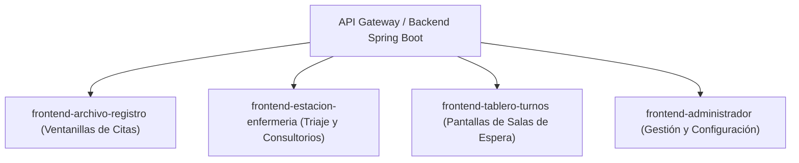
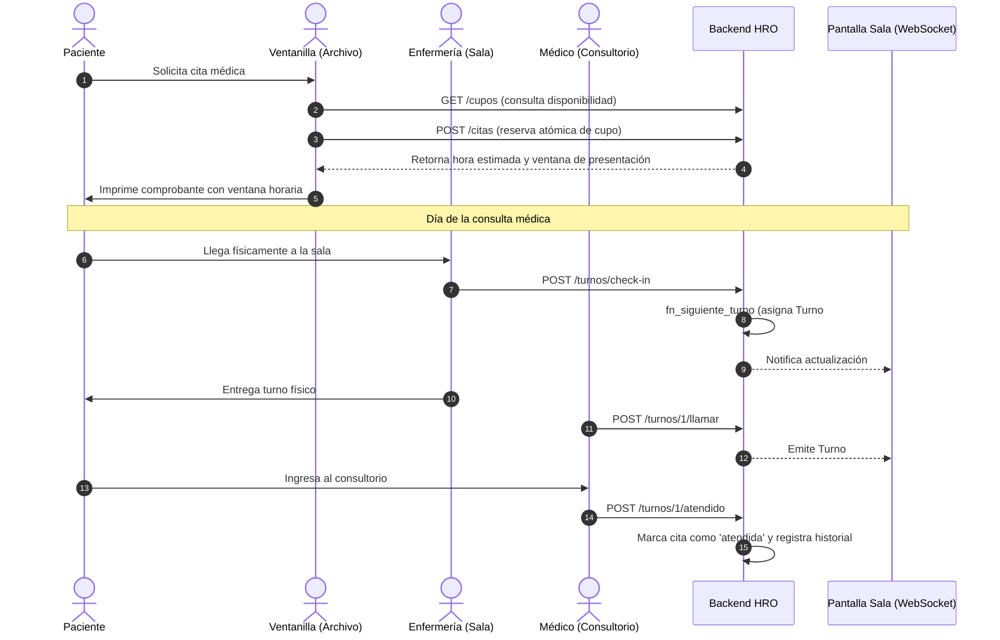

# Guía de Integración Backend - Frontend
## Sistema de Gestión Hospitalaria - Hospital Regional de Occidente (HRO)

**Audiencia:** Desarrolladores de Frontend (React / Angular / Vue / Mobile / Pantallas)  
**URL Base de la API REST:** `http://localhost:8081/api/v1`  
**Endpoint WebSocket (STOMP):** `ws://localhost:8081/api/v1/ws`  
**Documentación Interactiva (Swagger UI):** `http://localhost:8081/api/v1/swagger-ui.html`  
**Especificación OpenAPI JSON:** `http://localhost:8081/api/v1/v3/api-docs`  

---

## 1. Arquitectura y Módulos Frontend

El sistema está dividido operativamente en 4 aplicaciones frontend especializadas, correspondientes a las ramas de trabajo del repositorio:



---

## 2. Convenciones Globales de la API

### 2.1 Formato Estándar de Respuesta (`ApiResponse<T>`)
Todas las respuestas de la API REST (tanto éxitos como errores controlados) utilizan la misma estructura JSON:

```json
{
  "timestamp": "2026-09-11T17:55:17.336",
  "success": true,
  "message": "Operación realizada con éxito",
  "data": { ... }
}
```

### 2.2 Códigos HTTP y qué debe hacer el Frontend

| Código HTTP | Significado | Comportamiento Esperado en el Frontend |
| :--- | :--- | :--- |
| **`200 OK`** | Consulta o actualización exitosa. | Renderizar datos actualizados o notificar éxito con un toast/snackbar. |
| **`201 Created`** | Recurso creado exitosamente (cita, turno, paciente). | Redirigir a vista de detalle, imprimir comprobante o refrescar la lista. |
| **`400 Bad Request`** | Error de validación de campos o regla de negocio. | Resaltar los campos erróneos en el formulario con el mensaje devuelto en `data`. |
| **`404 Not Found`** | Recurso no encontrado. | Mostrar mensaje amigable de "Elemento no encontrado" y permitir buscar de nuevo. |
| **`409 Conflict`** | **Cupos agotados / Sobrecupo prevenido.** | Mostrar una **alerta visible y destacada**: *"No hay cupos disponibles para la fecha seleccionada. Por favor seleccione otra fecha u otro médico."* |
| **`500 Error`** | Error interno del servidor. | Mostrar notificación de error del sistema e invitar a reintentar. |

### 2.3 Autenticación en pruebas (modo simulado / mock)

El hospital autentica a su personal con un **servicio externo local que aún no está disponible**. Para no bloquear el desarrollo del frontend, el backend opera en **modo `mock`**: la identidad se simula con cabeceras HTTP y el usuario se aprovisiona automáticamente (JIT) en la tabla `usuario_referencia`.

**Cabeceras de simulación (opcionales):**

| Cabecera | Descripción | Ejemplo |
| :--- | :--- | :--- |
| `X-Usuario-Id` | Identificador externo del usuario. | `enfermeria-01` |
| `X-Usuario-Rol` | Rol operativo (`personal_citas`, `enfermeria`, `medico`, `administrador`, `archivo`). | `enfermeria` |
| `X-Usuario-Nombre` | Nombre a mostrar (opcional). | `Enfermera de Pruebas` |

Si no se envían cabeceras, el backend usa por defecto el usuario **`admin-hro-01`** con rol **`administrador`**, de modo que ninguna consulta falla.

**Usuarios de prueba precargados (seeds):** `admin-hro-01` (administrador), `personal-citas-01`, `enfermeria-01`, `medico-01`, `archivo-01`.

**El campo `usuarioId` ahora es opcional** en todos los cuerpos/parámetros. Si se envía, tiene prioridad; si se omite, se toma del usuario autenticado (cabeceras o usuario por defecto). Así el frontend puede migrar gradualmente.

**Endpoints de verificación:**

```http
GET /api/v1/auth/modo     -> { "modo": "mock" }
GET /api/v1/auth/perfil   -> identidad resuelta (id, idExterno, nombreMostrar, rolPrincipal)
```

Ejemplo con `curl`:

```bash
curl -H "X-Usuario-Id: enfermeria-01" -H "X-Usuario-Rol: enfermeria" \
     http://localhost:8081/api/v1/auth/perfil
```

> [!NOTE]
> Cuando el hospital habilite su servicio real, solo se implementa `HospitalProveedorIdentidad` y se cambia `HRO_AUTH_MODE=external`. El frontend no requiere cambios (seguirá enviando su token/credenciales reales).

---

## 3. Guía Específica por Módulo Frontend

---

### MÓDULO 1: `frontend-archivo-registro` (Ventanilla de Citas y Archivo)

Este módulo es utilizado por el personal de ventanilla para registrar pacientes, consultar cupos disponibles, agendar citas, imprimir el comprobante con ventana horaria, reprogramar o cancelar.

#### 1. Buscar o Registrar Paciente
* **Buscar:** `GET /api/v1/pacientes/buscar?filtro={dpi_o_expediente_o_nombre}`
* **Crear paciente nuevo:**
  ```http
  POST /api/v1/pacientes
  Content-Type: application/json

  {
    "dpi": "2541897450101",
    "nombres": "María Fernanda",
    "apellidos": "López Morales",
    "fechaNacimiento": "1994-06-15",
    "sexo": "F",
    "telefono": "55512345",
    "direccion": "Zona 3, Quetzaltenango",
    "numeroExpediente": "EXP-2026-089"
  }
  ```
  > **Nota sobre el Expediente:** El sistema no almacena historias clínicas completas; `numeroExpediente` es un puntero hacia el archivo físico o sistema preexistente del hospital.

#### 2. Consultar Disponibilidad de Cupos en Calendario
Antes de agendar, la ventanilla debe mostrar qué días y con qué médicos hay cupos disponibles:
* `GET /api/v1/cupos?subespecialidadId=1&fechaInicio=2026-09-14&fechaFin=2026-09-28`

**Respuesta recibida:**
```json
{
  "success": true,
  "data": [
    {
      "id": 10,
      "medicoSubespecialidadId": 3,
      "medicoNombre": "Dra. Sofía Reyes",
      "subespecialidadNombre": "Pediatría General",
      "fecha": "2026-09-15",
      "horaInicio": "07:00:00",
      "horaFin": "12:00:00",
      "capacidadMaxima": 20,
      "cuposOcupados": 14,
      "cuposDisponibles": 6,
      "disponible": true
    }
  ]
}
```
* **Comportamiento en UI:**
  - Si `disponible == false` o `cuposDisponibles == 0`: pintar el día en **rojo** o deshabilitar el botón de selección.
  - Si `disponible == true`: pintar en **verde** mostrando cuántos cupos libres quedan (`"6 cupos libres"`).

#### 3. Agendar Cita y Generar Comprobante
```http
POST /api/v1/citas
Content-Type: application/json

{
  "pacienteId": 5,
  "cupoDiarioId": 10,
  "usuarioId": 1
}
```
**Respuesta del Backend:**
```json
{
  "success": true,
  "message": "Cita agendada exitosamente",
  "data": {
    "id": 42,
    "pacienteNombreCompleto": "María Fernanda López Morales",
    "pacienteDpi": "2541897450101",
    "pacienteExpediente": "EXP-2026-089",
    "fechaCita": "2026-09-15",
    "subespecialidadNombre": "Pediatría General",
    "medicoNombre": "Dra. Sofía Reyes",
    "horaEstimada": "08:10:00",
    "horaVentanaInicio": "07:55:00",
    "horaVentanaFin": "08:45:00",
    "posicionEnFila": 3,
    "minutosEsperaEstimados": 70,
    "estado": "pendiente"
  }
}
```

> [!NOTE]
> **Hora estimada escalonada:** el backend calcula `horaEstimada = horaInicio + (posicionEnFila - 1) × duracionConsulta`, por lo que **cada cita tiene una hora distinta y no choca con las demás** del mismo médico. `minutosEsperaEstimados` es el tiempo aproximado desde el inicio de la jornada y `posicionEnFila` la posición en la fila. La ventana de presentación (`horaVentanaInicio`–`horaVentanaFin`) es el rango recomendado para que el paciente llegue.
>
> **Días habilitados:** cada subespecialidad/médico atiende solo ciertos días (p. ej. Pediatría Especializada abre **solo lunes y jueves**). Si se intenta agendar en un día no habilitado, el backend responde `400`. Consulta los días válidos con `GET /api/v1/medico-subespecialidades/subespecialidad/{subespecialidadId}` o con `GET /api/v1/cupos`.

> [!IMPORTANT]
> **Diseño del Comprobante Impreso / Ticket para el Paciente:**
> Nunca imprimas al paciente únicamente la `horaEstimada` exacta (para evitar que se moleste si la consulta previa se alarga 10 minutos).
> **Debes imprimir de forma destacada la Ventana de Presentación:**
> * *"Fecha de Cita: Martes 15 de Septiembre de 2026"*
> * *"Horario sugerido de presentación en sala: **07:55 AM a 08:45 AM**"*
> * *"Hora estimada de atención médica: **08:10 AM**"*
> * *"Por favor presentarse con su documento de identificación en la Estación de Enfermería del Módulo B para confirmar su llegada y recibir su turno."*

#### 4. Reprogramar una Cita
Si el paciente llama o acude a cambiar su cita:
```http
POST /api/v1/citas/{citaId}/reprogramar
Content-Type: application/json

{
  "nuevoCupoDiarioId": 18,
  "usuarioId": 1,
  "motivo": "Paciente solicita cambio por viaje de trabajo"
}
```
* El backend automáticamente libera el cupo anterior, reserva el nuevo y enlaza la cita mediante `cita_origen_id`.

#### 5. Cancelar una Cita
```http
POST /api/v1/citas/{citaId}/cancelar
Content-Type: application/json

{
  "usuarioId": 1,
  "motivo": "Cancelada con anticipación por el paciente"
}
```
* El cupo se libera de inmediato en PostgreSQL para que otra persona pueda agendarlo.

---

### MÓDULO 2: `frontend-estacion-enfermeria` (Triaje, Consultorios y Atención)

Este módulo es utilizado por el personal de enfermería en los módulos de consulta externa y los médicos en sus consultorios.

#### 1. Check-in Presencial del Paciente (Llegada Física)
El paciente llega a la sala y presenta su ticket o DPI. La enfermera busca la cita del día y hace clic en **"Confirmar Llegada (Check-in)"**:

```http
POST /api/v1/turnos/check-in
Content-Type: application/json

{
  "citaId": 42,
  "usuarioId": 2
}
```
**Respuesta:**
```json
{
  "success": true,
  "data": {
    "id": 105,
    "citaId": 42,
    "numeroTurno": 7,
    "estado": "en_espera",
    "subespecialidadNombre": "Pediatría General",
    "medicoNombre": "Dra. Sofía Reyes",
    "horaGenerado": "2026-09-15T07:52:14-06:00"
  }
}
```
* **Efecto Inmediato:**
  - Se genera el **Turno #7** (número correlativo atómico del día en esa clínica).
  - La cita cambia automáticamente a estado `confirmada`.
  - El paciente ingresa a la lista de espera visual de enfermería.
  - El tablero de sala se actualiza en tiempo real vía WebSocket.

#### 2. Visualización de la Fila de Espera en la Clínica
* `GET /api/v1/turnos/asignacion/{asignacionDiariaEspacioId}`
* Muestra la tabla de pacientes en espera ordenados por `numeroTurno`.

#### 3. Llamar a Consultorio (Médico / Enfermera)
Cuando el médico está listo para el siguiente paciente, presiona el botón **"Llamar Siguiente"** o **"Llamar Turno"**:

```http
POST /api/v1/turnos/{turnoId}/llamar?usuarioId=2
```
* **Comportamiento en UI:**
  - El turno pasa a `llamado`.
  - En la pantalla de enfermería inicia un **temporizador regresivo de tiempo de gracia** (por defecto 3 minutos / 180 segundos).
  - El tablero de la sala de espera empieza a parpadear y emite una alerta sonora.

#### 4. Paciente no se presenta tras el llamado (`no_responde`)
Si el paciente no acude tras agotarse el tiempo de gracia o los reintentos de llamado, el personal presiona **"Marcar No Responde"**:

```http
POST /api/v1/turnos/{turnoId}/no-responde?usuarioId=2&motivo=PacienteNoSePresentoTras3Llamados
```
* **Comportamiento en UI:**
  - El turno cambia a `no_responde`.
  - La fila **NO se bloquea**: el botón "Llamar Siguiente" se habilita de inmediato para llamar al próximo turno.
  - El paciente no respondido pasa a una pestaña o sección lateral: *"Pacientes No Respondidos del Día"*.

#### 5. Reintegración del Paciente el Mismo Día
Si el paciente regresa 45 minutos después (ej. *"Disculpe, estaba en el laboratorio haciéndome exámenes"*), la enfermera busca su turno en la lista de no respondidos y presiona **"Reintegrar a la Fila"**:

```http
POST /api/v1/turnos/{turnoId}/reintegrar
Content-Type: application/json

{
  "usuarioId": 2,
  "motivo": "Paciente regresó con resultados de laboratorio"
}
```
**Respuesta:**
```json
{
  "success": true,
  "data": {
    "id": 105,
    "citaId": 42,
    "numeroTurno": 18,
    "estado": "reintegrado"
  }
}
```
* **Regla de Negocio:**
  - **No crea una cita nueva ni un turno nuevo**.
  - Conserva el historial pero le asigna **un nuevo turno al final de la fila actual** (ej. Turno #18).
  - Se actualiza el tablero automáticamente.

#### 6. Finalizar Atención Médica
Al terminar la consulta en el consultorio:
```http
POST /api/v1/turnos/{turnoId}/atendido?usuarioId=2
```
* El turno pasa a `atendido` y la cita pasa a `atendida`.

#### 7. Cierre de Jornada Operativa
Al finalizar el turno matutino o vespertino, la jefa de enfermería o administración ejecuta el cierre del día:
```http
POST /api/v1/citas/cierre-diario
Content-Type: application/json

{
  "fecha": "2026-09-15",
  "subespecialidadId": 1,
  "usuarioId": 2
}
```
* Pasa todas las citas pendientes que nunca llegaron a check-in y todos los turnos que quedaron en `no_responde` al estado final **`no_asistio`**.
* **Garantía:** No libera cupos diarios.

---

### MÓDULO 3: `frontend-tablero-turnos` (Pantallas de Salas de Espera)

Esta aplicación web corre a pantalla completa (*kiosk mode*) en Smart TVs o monitores conectados en las salas de espera de cada módulo.

#### 1. Conexión WebSocket STOMP
* **Librerías recomendadas:** `@stomp/stompjs` y `sockjs-client`.
* **Broker URL:** `ws://localhost:8081/api/v1/ws`
* **Suscripciones disponibles:**
  - Canal General (todas las asignaciones del día): `/topic/tablero`
  - Canal Específico por asignación diaria (sala + subespecialidad): `/topic/clinica/{asignacionDiariaEspacioId}`

#### 2. Estructura del Payload WebSocket (`TableroTurnoDTO`)
Cada vez que se hace check-in, se llama a un paciente o se cambia un estado, el backend emite este evento:

```json
{
  "asignacionDiariaEspacioId": 1,
  "espacioNumero": "201",
  "nivel": 2,
  "subespecialidadNombre": "Pediatría General",
  "turnoActual": 7,
  "turnoSiguiente": 8,
  "ultimaActualizacion": "2026-09-15T08:05:32-06:00"
}
```

#### 3. Recomendaciones de UX para la Pantalla de Turnos
1. **Doble Indicador:** Mostrar claramente en números gigantes (ej. font-size 96px):
   - **TURNO ACTUAL: #07** (en verde o amarillo brillante con animación de pulso).
   - **SIGUIENTE EN FILA: #08** (en gris o azul para que el paciente esté listo).
2. **Alerta Sonora:** Al recibir un evento donde `turnoActual` cambie, reproducir un archivo de audio tipo campanilla (*chime/ding-dong*).
3. **Síntesis de Voz (Opcional):** Si el navegador lo soporta (`window.speechSynthesis`), pronunciar: *"Turno número siete, favor pasar a Clínica de Pediatría uno"*.

---

### MÓDULO 4: `frontend-administrador` (Configuración y Gestión)

Utilizado por la dirección médica y coordinadores para mantener los catálogos base:

1. **Especialidades y Subespecialidades:**
   - `GET /api/v1/especialidades`
   - `POST /api/v1/especialidades`
   - `GET /api/v1/subespecialidades?especialidadId={id}`
   - `POST /api/v1/subespecialidades`
2. **Espacios físicos (salas/consultorios):**
   - `GET /api/v1/espacios-fisicos`
   - `POST /api/v1/espacios-fisicos` (numero, nivel, capacidadCamillas, coordenadasPlano, nombre, ubicacion).
   - `GET /api/v1/espacios-fisicos/nivel/{nivel}`
3. **Médicos y programación por subespecialidad:**
   - `POST /api/v1/medicos` (nombres, número de colegiado).
   - `POST /api/v1/medico-subespecialidades`: Asigna al médico una subespecialidad con día de la semana (`1..7`), hora inicio, hora fin, capacidad máxima y duración estimada. **No** referencia sala física.
4. **Asignación diaria (rol `jefe_enfermeria`):** define qué subespecialidad ocupa qué sala cada día.
   - `GET /api/v1/asignaciones-diarias?fecha=YYYY-MM-DD`
   - `POST /api/v1/asignaciones-diarias` `{ espacioFisicoId, subespecialidadId, fecha }`
   - `GET /api/v1/asignaciones-diarias/cobertura?fecha=YYYY-MM-DD` → subespecialidades con médicos programados sin sala asignada.
   - `POST /api/v1/asignaciones-diarias/cerrar?fecha=YYYY-MM-DD` → bloquea la edición (exige cobertura completa).
   - `POST /api/v1/asignaciones-diarias/duplicar?fechaOrigen=&fechaDestino=` → copia la asignación de una fecha anterior.
   - `POST /api/v1/asignaciones-diarias/{id}/reasignar?nuevoEspacioFisicoId=&motivo=` → "reasignación en caliente" para una fecha ya cerrada (queda auditada).
5. **Calendario Institucional:**
   - `GET /api/v1/dias-no-laborables` (todos), `GET /api/v1/dias-no-laborables/futuros`, `GET /api/v1/dias-no-laborables/rango?inicio=YYYY-MM-DD&fin=YYYY-MM-DD`, `GET /api/v1/dias-no-laborables/{id}`.
   - `POST /api/v1/dias-no-laborables` `{ fecha, motivo, creadoPorId?, forzar? }`:
     - `201` si la fecha no tiene citas activas.
     - `409` con `codigo: "DIA_NO_LABORABLE_CON_CITAS"` y `data: { fecha, totalCitas, citas: [{ id, horaEstimada, estado, pacienteNombre, medicoNombre, subespecialidadNombre }] }` si existen citas activas (cualquier estado distinto de `cancelada` o `reprogramada`). El frontend debe mostrar las citas afectadas, pedir confirmación explícita y reintentar con `forzar: true` para bloquear igualmente (las citas quedan pendientes de reprogramación manual).
     - `400` con `codigo: "DIA_NO_LABORABLE_YA_EXISTE"` si la fecha ya está registrada.
   - `PUT /api/v1/dias-no-laborables/{id}` `{ motivo }` edita el motivo (la fecha no se modifica; para cambiarla, eliminar y volver a crear).
   - `DELETE /api/v1/dias-no-laborables/{id}` habilita la fecha de nuevo.
   - **Códigos de error estructurados:** toda respuesta de `ApiResponse` puede incluir `codigo` (nullable) además de `message`; usar `codigo` para el manejo programático y `message` para mostrar al usuario.
6. **Disponibilidad y reprogramación (Admin):**
   - `GET /api/v1/cupos?soloDisponibles=true&subespecialidadId=&medicoId=&medicoSubespecialidadId=&fechaInicio=&fechaFin=` → disponibilidad por programación y rango; `soloDisponibles=true` omite los cupos sin disponibilidad.
   - `GET /api/v1/citas/{id}/disponibilidad?fechaInicio=&fechaFin=` → cupos de la **misma programación** (médico + subespecialidad) de la cita, para reprogramar **conservando médico y subespecialidad**.
   - `POST /api/v1/citas/{id}/reprogramar` `{ nuevoCupoDiarioId, motivo }` confirma el cambio (2 pasos: consultar y confirmar). Si el cupo está lleno → `409` (`CUPOS_AGOTADOS`).
   - **No existe reprogramación automática**: el administrador decide cada cambio. Flujo definido en [`docs/FLUJO_ADMIN_DISPONIBILIDAD.md`](./FLUJO_ADMIN_DISPONIBILIDAD.md).
7. **Dashboard administrativo:**
   - `GET /api/v1/dashboard/resumen?fecha=YYYY-MM-DD` (por defecto, hoy) → indicadores agregados calculados en backend: `totalCitas`, `citasPendientes/Confirmadas/Atendidas/Canceladas/Reprogramadas`, `inasistencias`, `capacidadTotal`, `cuposOcupados`, `cuposDisponibles`, `tasaInasistencia` y `alertas`.
   - Alertas (`codigo` / `severidad`): `CITAS_EN_DIA_NO_LABORABLE` (CRITICA), `CUPOS_AGOTADOS` (ADVERTENCIA), `DIAS_NO_LABORABLES_PROXIMOS` (INFO). El frontend solo las muestra; no recalcula indicadores.
8. **Reportes administrativos** (todos con `fechaInicio`/`fechaFin`; por defecto, últimos 30 días):
   - `GET /api/v1/reportes/citas-por-estado` → `total` y `porEstado` (conteo por estado).
   - `GET /api/v1/reportes/demanda-por-especialidad` → `items` con `totalCitas`, `atendidas`, `inasistencias` por especialidad.
   - `GET /api/v1/reportes/utilizacion-cupos?subespecialidadId=` → `capacidadTotal`, `cuposOcupados`, `cuposDisponibles`, `utilizacionPorcentaje`.
   - Si `fechaFin < fechaInicio` → `400`. El frontend solo muestra; no agrega en cliente.
9. **Auditoría administrativa** (solo rol `administrador`; otros roles → `403` `ACCESO_DENEGADO`):
   - `GET /api/v1/auditoria?tabla=&usuarioId=&accion=&fechaInicio=&fechaFin=&page=&size=` → página de `AuditoriaResponseDTO` (`id`, `tablaAfectada`, `entidadId`, `accion`, `usuarioId`, `usuarioNombre`, `valoresAnteriores`, `valoresNuevos`, `fecha`). Paginada (por defecto `size=20`, orden `fecha` DESC).
   - No expone la entidad JPA ni relaciones lazy. Vista de solo lectura.
   - Los valores `anteriores`/`nuevos` son JSON en texto; el endpoint está restringido por rol para reducir la exposición de datos sensibles (PII).

---

### MÓDULO 5: `frontend-archivo` (Seguimiento de Expedientes Físicos)

Estación operada por el rol `archivo`. Modela el recorrido físico del expediente (búsqueda, entrega a la clínica y retorno) mediante un ciclo por cita. El contrato completo (entidades, máquina de estados y ejemplos) está en **[`docs/MODULO_ARCHIVO.md`](./MODULO_ARCHIVO.md)**.

1. **Buscar el expediente (escaneo):**
   - `GET /api/v1/expedientes/{id}` → UUID (código QR).
   - `GET /api/v1/expedientes/numero/{numeroExpediente}` → número impreso (código de barras).
   - `GET /api/v1/expedientes/buscar?filtro=&page=&size=` → búsqueda manual (respuesta paginada en `data.content`).
2. **Iniciar el viaje de una cita:**
   - `POST /api/v1/expediente-ciclos` `{ expedienteId, citaId }` → estado inicial `pendiente_localizar` (409 si la cita ya tiene ciclo).
3. **Avanzar el recorrido (cada llamada registra un `expediente_movimiento`):**
   - `POST /api/v1/expediente-ciclos/{id}/iniciar-busqueda`
   - `POST /api/v1/expediente-ciclos/{id}/localizar`
   - `POST /api/v1/expediente-ciclos/{id}/despachar` `{ ubicacionDestinoId? }`
   - `POST /api/v1/expediente-ciclos/{id}/entregar`
   - `POST /api/v1/expediente-ciclos/{id}/retornar`
   - `POST /api/v1/expediente-ciclos/{id}/archivar` `{ ubicacionDestinoId }`
   - `POST /api/v1/expediente-ciclos/{id}/no-localizado` `{ observacion }` (no terminal)
   - `POST /api/v1/expediente-ciclos/{id}/reintentar-busqueda`
4. **Consultar el timeline:** `GET /api/v1/expediente-ciclos/{id}` devuelve el ciclo con su lista de `movimientos` (checkpoints).

---

## 4. Resumen de Flujo de Datos Completo (End-to-End)



---

## 5. Contacto y Recursos para Desarrollo
- **Colección Postman / Swagger:** Disponible en `http://localhost:8081/api/v1/swagger-ui.html`.
- **Canal de Preguntas Backend:** Para dudas o ajustes en contratos DTO, revisar los archivos en `backend/src/main/java/com/hro/system/`.
