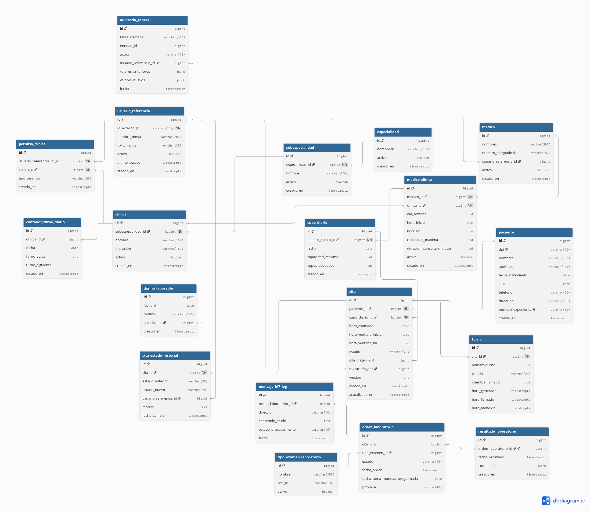

# Diagramas del Sistema

## 📊 Diagrama Entidad-Relación (ERD) - Versión 1

### 📌 Documentos y Scripts Relacionados:
* **Esquema SQL v1**: [`database/migrations/v1_esquemainicial.sql`](../../database/migrations/v1_esquemainicial.sql)
* **ADR de Arquitectura**: [`docs/adrs/ADR-001-stack-tecnologico.md`](../adrs/ADR-001-stack-tecnologico.md)
